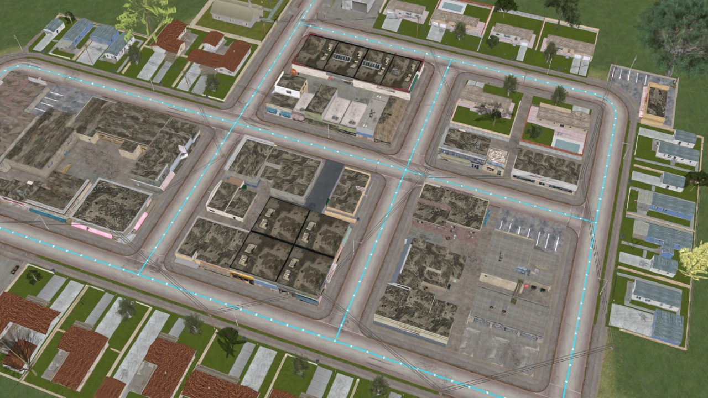
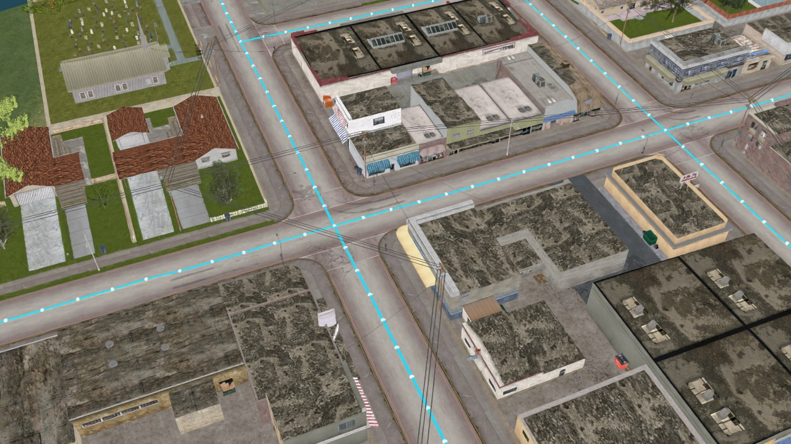
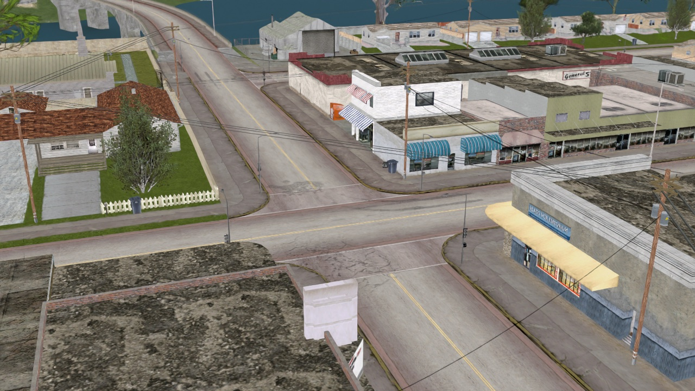
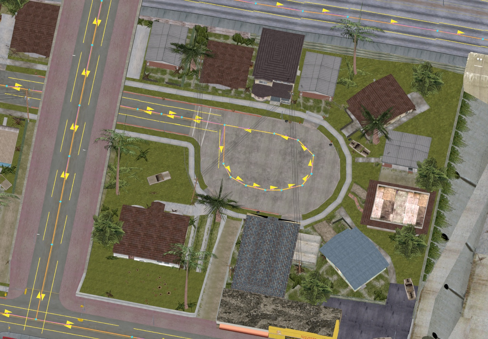
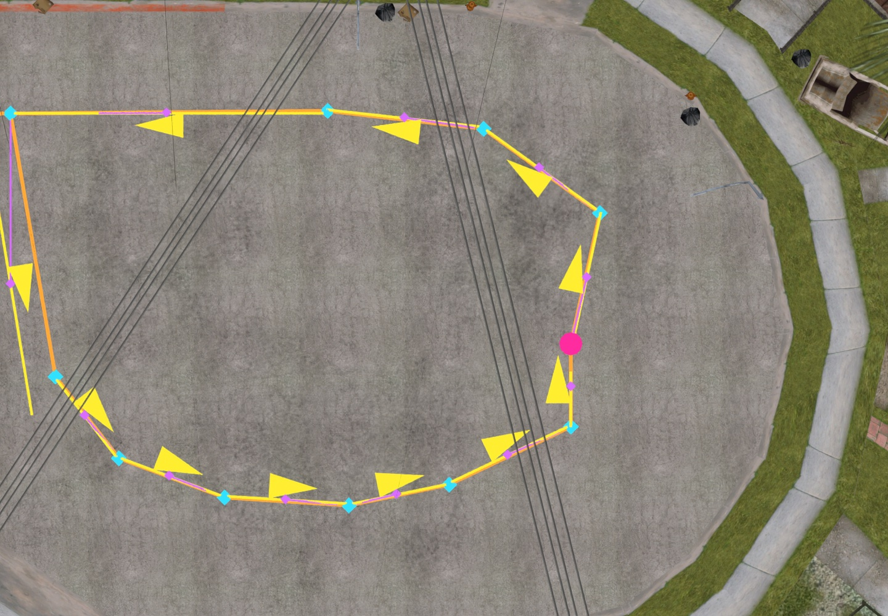
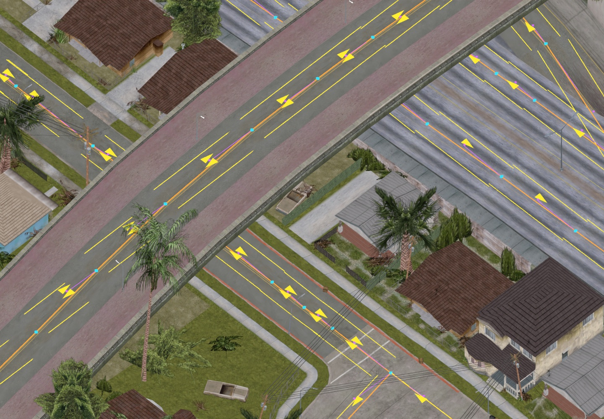
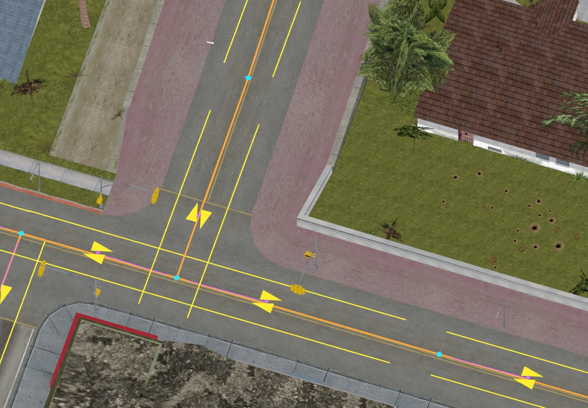
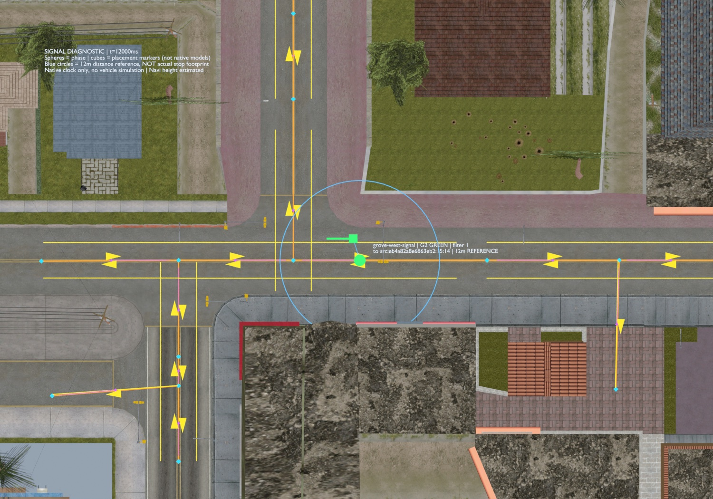
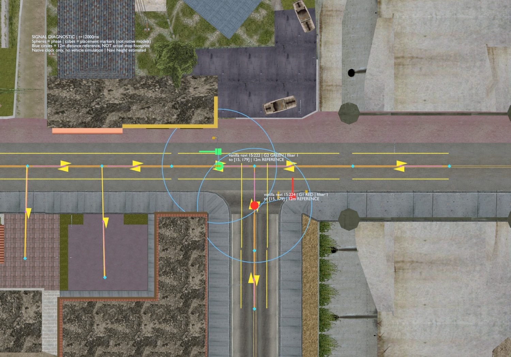

# GTA Flow

**[Join the Discord community →](https://discord.gg/mgFRd2AzF8)**

**Create and edit GTA San Andreas traffic routes with AI and Blender.** Early alpha, for the audited PC `sa_compact` layout.

## Get started with your AI

**Give your AI this repo and tell it what you want to do.** It can check your setup, install the tools it needs, and walk you through anything that needs your help. Use an AI coding agent that can access files and run commands on your computer.

Copy this into your agent:

> Help me set up https://github.com/Dryxio/gta-flow. Read the README and agent guide, check what's already installed on my computer, and help me install what's missing, including Blender for the preview. Start with the included road intersection example: show me its traffic routes in Blender, check that the network is valid, and export the traffic files. Save the Blender scene and a preview image so I can see the result.

No GTA files are needed for this first example. The Blender preview shows the routes; testing cars driving on them happens in the game.

## What it does

This is an explicit graph authoring tool: an agent examines your map, proposes road centerlines, configures lanes and junctions, and validates the generated network. It does **not** automatically recognize every road in an arbitrary mesh or simulate GTA driving inside Blender.

- Create a road network from zero, or import and edit your own existing NODES.
- Deterministic compilation, stable IDs, region remapping and separate binary verification.
- One-way roads, explicit connections, grade-separated crossings, junction movement connectors.
- Native two-group traffic signals, optional vanilla signal placements as IPL.
- Headless Blender overlays, editable positions, tagged centerline extraction and road-surface diagnostics.
- Standard-library Python core. No game, private catalogue, server or hosted AI service required.

A custom-map network on Perry Island has been tested by the maintainer in game with moving traffic. That is one integration test, not compatibility certification for every map, executable or mod stack. The public examples and tests are synthetic; Perry and GTA assets are not included.

## See it on real maps

All ten images below are **Blender renders/diagnostic previews**, not gameplay screenshots. Map assets stay local and are not included in this repository. The overlays show actual imported or compiled networks; they are not AI-generated concept images.

### Perry Island: a new network on a custom map



**267 nodes · 271 segments.** A retrospective visualization of the final exported Caico network, using the corrected textured map import. The maintainer separately tested this network in game and observed moving traffic.

| Inspect the intersection | Keep the map context visible |
|---|---|
|  |  |
| Final network at street intersections. Cyan lines and white markers visualize exported connectivity. | The same custom-map context with the overlay hidden. Correct material splits preserve road and building textures. |

### Vanilla San Andreas: import and edit an existing network



**Existing NODES are editable too.** This view comes from the original 64-region network, imported locally and displayed on a textured Grove Street chunk. Cyan markers identify nodes; yellow arrows/lines visualize permitted direction and estimated lane centers.

| Original imported network | Edited, compiled, then reimported |
|---|---|
|  |  |
| Pink highlights the native node selected for the edit. | The selected node moved 2 world units west; adjacent navigation geometry was rebuilt. |

This was an actual file-level roundtrip, not a moved overlay: **64 regions imported, one node edited, region 15 rebuilt, all 63 other regions byte-identical, and the new position verified after DAT reimport.** No game files were installed or overwritten. This demonstrates editing support, not a recommended road redesign or a driving test. [Repeat the workflow with your own files →](docs/edit-existing-network.md)

| Overpass and streets beneath | Street-level navigation detail |
|---|---|
|  |  |
| Inspect elevation and separate road paths in the actual map context. | Inspect native connectivity and lane direction before making an edit. |

### Native signal diagnostics

| Compiled signal association | Imported native phase groups |
|---|---|
|  |  |
| Manifest-driven preview at 12000 ms: phase group, controlled direction and declared placement marker. | At the same global-clock time, group 2 is green and group 1 is red. |

Spheres/cubes are diagnostic markers, not replacement traffic-light models. Blue circles are **12-unit distance references**, not actual stopping footprints. These previews verify associations and phase display; they do not simulate vehicles. [Signal support and limitations →](docs/controls.md)

## Manual setup

Prefer to install it yourself? Expand the instructions below.

<details>
<summary>Manual installation, configuration and examples</summary>

## Quick start (no game or Blender required)

Python 3.10+:

```sh
git clone https://github.com/Dryxio/gta-flow.git
cd gta-flow
python -m venv .venv
# POSIX: source .venv/bin/activate
# Windows PowerShell: .venv\Scripts\Activate.ps1
python -m pip install .
sa-traffic --help
sa-traffic validate examples/roads-from-zero.json --output output/check.json
sa-traffic compile examples/roads-from-zero.json --output output/roads-build-001
sa-traffic compile examples/signaled-intersection.json --output output/signals-build-001
```

Build directories must be new. `compile` writes only affected regions, plus a manifest and verification report. It does not install files into your game. For an entirely new map, a separate test setup must supply all required regions, map registrations and collisions; see [installation](docs/installation.md).

## With Blender and an AI agent

Give your agent this repository, your own map/game paths and the Blender executable. Start with [AGENTS.md](AGENTS.md) and the [Blender CLI guide](docs/blender.md).

```sh
blender --background --factory-startup --python-exit-code 1 --python sa_traffic/blender_bridge.py -- --input examples/roads-from-zero.json --output output/roads.blend --render output/roads.png
```

To inspect your map, open its `.blend` instead of `--factory-startup`. The bridge preserves map objects and owns a separate `SA Traffic` collection. Blender is needed only for this part. DragonFF is an optional, separately installed DFF importer; **use `read_mat_split=True`** when importing maps to preserve face/material assignments.

A suggested prompt:

> Read AGENTS.md. Inspect my custom map in Blender, propose an explicit vehicle road network for this chunk, configure directions and junctions, verify surfaces, compile and inspect the exported nodes. Use my supplied game files only as local context. Report unsupported cases and provide NODES plus a manifest; keep the original game unchanged.

</details>

## Scope and limits

- One backend: `sa_compact`, 64 regions and original packed addressing. No FLA/extended-map, Definitive Edition, console or MTA traffic runtime backend.
- Road centerlines and lane counts need authoring. Crossing lines do not automatically join.
- Turn restrictions describe the normal directed navigation graph. Some native AI fallback paths can ignore lanes; strict enforcement is rejected, not promised.
- Signals use two global phase groups. No arbitrary per-junction timers or protected multi-phase program.
- Geometry checks and Blender renders are diagnostics, not vehicle/collision/spawn simulation.
- Imported NODES JSON includes original file bytes for lossless preservation: keep your imported documents private.

Read [authoring](docs/authoring.md), [signals and junctions](docs/controls.md), [installation](docs/installation.md), and [validation and format profile](docs/validation.md).

## Development

```sh
python -m unittest discover -s tests/sa_traffic -v
```

Synthetic core tests run without a game. Set `BLENDER_BIN` to enable actual Blender headless tests (or put `blender` on PATH). Optional original-corpus regression tests require a user-supplied 64-file `SA_NODES_CORPUS`; they are skipped by default and are not redistributed. CI runs the game-free suite on Python 3.10/3.12/3.14 and a clean wheel installation smoke.

## Related project

[GTA Scout](https://github.com/Dryxio/gta-scout) helps agents discover reusable GTA assets. This compiler lives separately because it is useful without an asset catalogue and has its own binary compatibility and validation requirements.

MIT for this project's original code. See [NOTICE.md](NOTICE.md). No Rockstar assets, game executable, decompiler output or DragonFF code is bundled.
